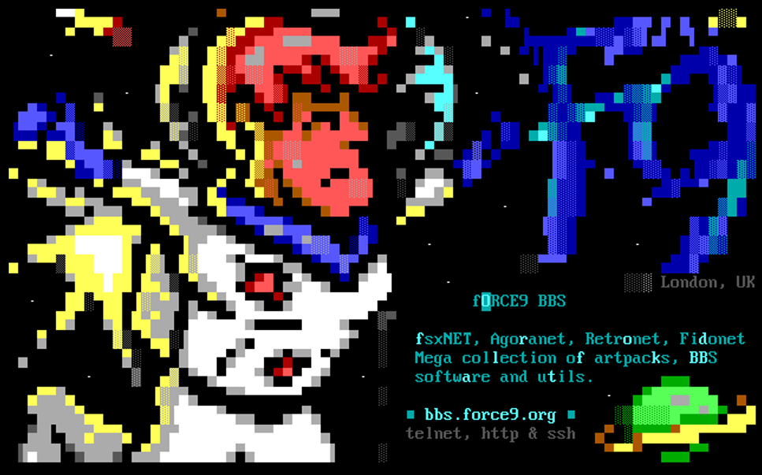

# BBS ANSI Adverts
A community contributed collection of BBS ANSI adverts (like the one below) that can be randomly loaded as
users log off of BBS's. 



## How To Use
### Linux
`./tools/make_set.sh` will copy and rename the adverts based on the format required by your BBS software.

Example: 
````bash
./tools/make_set.sh enigma ~/enigma-bbs/art
````

`make_set.sh` currently supports [ENiGMA½](https://github.com/NuSkooler/enigma-bbs) and [Mystic](http://www.mysticbbs.com), 
feel free to submit a PR if you want your BBS software supported!

### Windows
Example:
````
.\tools\make_set.ps1 -BBSType 1 -OutputDir D:\MyBBSFolder\Art -NumAds 5 -Overwrite
````

## How to add an advert
- Fork
- Add your advert into the `adverts` directory - please use a lowercase filename
- Add the relevant metadata to `adverts/adverts.json`
- Submit a PR
- Profit!

## TODO (help gratefully received!)
- Write native plugins for popular BBS software 
- Write a BBS checker to remove dead BBS's
````
